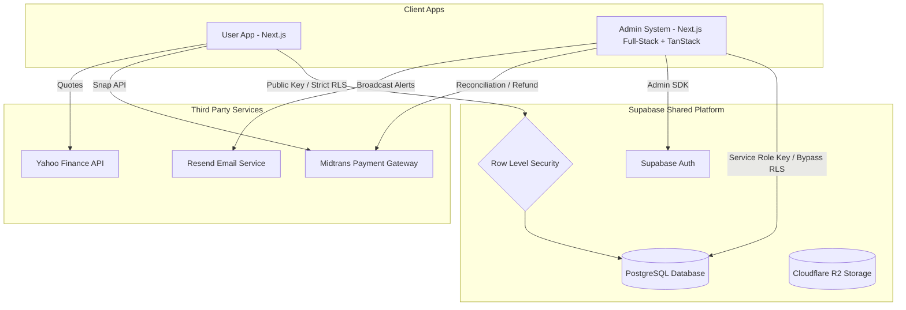

# Ngaturin Admin System - Architectural & Feature Design

Dokumen ini menyusun rencana arsitektur, daftar fitur, batasan sistem (*system boundaries*), dan model keamanan untuk **Ngaturin Admin System** yang akan dibangun sebagai **proyek terpisah** dari aplikasi utama pengguna (*User Application*).

---

## 1. Arsitektur Hubungan Proyek (Shared Database Model)

Karena Admin System didefinisikan sebagai proyek terpisah (*separate repository/deployment*), arsitektur terbaik adalah memanfaatkan **Shared Database Model** menggunakan instansi Supabase yang sama. Model ini sangat efisien karena tidak memerlukan replikasi data atau sinkronisasi API yang kompleks.



### Karakteristik Utama Arsitektur:
1. **User App Separation**: Aplikasi pengguna berinteraksi dengan database menggunakan *Supabase Anonymous Key* dengan Row Level Security (RLS) diaktifkan penuh (`auth.uid() = user_id`).
2. **Admin App Isolation**: Aplikasi admin berjalan pada sub-domain berbeda (misal: `admin.ngaturin.com`) atau jaringan internal. Aplikasi ini terhubung menggunakan *Supabase Service Role Key* yang secara otomatis menembus (*bypass*) RLS untuk melakukan fungsi manajemen lintas pengguna.
3. **Database Consistency**: Semua perubahan skema database dikelola melalui migrasi terpusat, memastikan kedua aplikasi selalu sinkron terhadap struktur tabel.

---

## 2. Fitur Utama Admin System

Sistem admin akan berfokus pada visualisasi metrik bisnis, audit finansial, pengelolaan transaksi langganan, manajemen gamifikasi, dan penanganan bantuan teknis (*customer support*).

### A. Global Business Intelligence Dashboard (Insight Eksekutif)
* **Kesehatan Bisnis**: Metrik finansial agregat seperti Monthly Recurring Revenue (MRR), Annual Recurring Revenue (ARR), dan total volume transaksi bulanan.
* **Pertumbuhan Pengguna**: Grafik pendaftaran harian/mingguan, tingkat retensi pengguna (*active usage cohorts*), dan persentase konversi gratis-ke-premium (*Plus & Pro plans*).
* **Rata-rata Ketahanan Finansial**: Agregasi data anonim tentang rata-rata *Emergency Runway* pengguna untuk riset pasar produk.

### B. User & Gamification Management (Manajemen Pengguna)
* **User Directory**: Pencarian, penyaringan, dan penelusuran status profil pengguna, tingkat level, XP aktif, dan histori pencapaian streak harian.
* **Level & XP Adjustments**: Konsol admin untuk menambahkan/mengurangi XP secara manual (untuk kompensasi kegagalan teknis, penghargaan komunitas, atau promosi).
* **Lencana Dinamis (Badge CRUD)**:
  * Antarmuka visual untuk membuat lencana (*badges*) baru tanpa menyentuh file migrasi SQL database.
  * Atur parameter pencapaian: `TRANSACTION_COUNT`, `STREAK_DAYS`, `GOAL_COMPLETED`, `DEBT_SETTLED`.
  * Sesuaikan besaran XP reward dan ikon lencana (Zap, Trophy, Flame, Crown, dll.).
* **Account Controls**: Fitur penangguhan (*suspend*) akun pengguna yang melanggar ketentuan layanan.

### C. Billing, Subscriptions, & Reconciliation (Manajemen Transaksi)
* **Subscription Logs**: Dashboard pelacakan status pembayaran yang tersinkron dengan Midtrans (Menampilkan status *Pending, Settlement, Expired, Cancel, Deny*).
* **Manual Override & Extension**: Fitur darurat untuk memperpanjang durasi aktif premium pengguna secara manual jika terjadi keterlambatan sinkronisasi webhook Midtrans.
* **Refund Console**: Integrasi dengan Core/Snap API Midtrans untuk memicu pengembalian dana (*refund*) transaksi premium langsung dari halaman admin.
* **Audit Rekonsiliasi**: Tombol audit sekali klik untuk mencocokkan data invoice lokal di tabel `subscriptions` Supabase dengan status transaksi aktual di server Midtrans.

### D. Asset Catalog Administration (Manajemen Aset)
* **Verified Symbol Directory**: Menambahkan, menyunting, atau menonaktifkan kode saham/kripto yang tersedia untuk pelacakan investasi pengguna.
* **Real-time Price Verifier**: Memverifikasi apakah simbol yang dimasukkan valid terhadap data Yahoo Finance sebelum didaftarkan ke publik.

### E. System Operations & Broadcast Tools
* **Audit Logs**: Rekaman aktivitas admin secara real-time (siapa admin yang memodifikasi data, melakukan refund, mengubah badge, atau menangguhkan akun) untuk kepatuhan keamanan (*compliance*).
* **Newsletter & Broadcast Engine**: Mengirim email tips keuangan berkala atau pengumuman sistem kepada seluruh/sebagian pengguna menggunakan integrasi **Resend** (menyaring target pengguna premium vs gratis).

---

## 3. Batasan Sistem (System Boundaries) & Tanggung Jawab

Memisahkan proyek berarti menetapkan batas operasional yang jelas agar tidak ada logika tumpang tindih (*overlap*) yang memicu bug data.

| Batasan / Area | Aplikasi Pengguna (User App) | Sistem Admin (Admin System) |
| :--- | :--- | :--- |
| **Akses Database** | Hanya dapat membaca/menulis data baris miliknya sendiri via RLS. | Dapat membaca/menulis seluruh baris data lintas pengguna via bypass RLS. |
| **Identitas Pengguna** | Hanya mengelola profil pribadinya sendiri. | Dapat mengelola status keanggotaan, peran (*roles*), dan penangguhan akun pengguna mana pun. |
| **Transaksi & Saldo** | Memicu mutasi dompet, transaksi harian, dan mutasi saldo riil secara langsung. | **DILARANG** membuat transaksi harian (pemasukan/pengeluaran) atas nama pengguna. Hanya boleh melakukan agregasi data. |
| **Pembayaran & Webhook** | Menginisiasi checkout Midtrans Snap & menerima webhook pembayaran langsung. | Mengaudit riwayat pembayaran, memantau MRR, dan memicu pengembalian dana (*refund*). |
| **Pemicu Gamifikasi** | Mengirimkan pemicu otomatis via kode server (misal: tambah transaksi = pemicu XP). | Mengatur cetak biru lencana (*badges blueprint*) dan melakukan penyesuaian XP secara manual. |

---

## 4. Keamanan & Autentikasi Admin (Security Model)

Mengingat Admin System memegang kendali penuh atas database (bypassing RLS), model keamanan harus dibuat sangat ketat:

1. **Role-Based Access Control (RBAC) pada Database**:
   * Menambahkan kolom `role` (enum: `'user'`, `'moderator'`, `'admin'`) pada tabel `user_profiles`.
   * Membuat *Trigger PostgreSQL* yang melarang akun tanpa peran `'admin'` atau `'moderator'` untuk berinteraksi dengan API Admin System.
2. **Middleware Auth Restriction**:
   * Router Admin System harus memeriksa token JWT pengguna menggunakan metadata Supabase. Jika profil pengguna tidak memiliki `role = 'admin'`, akses ditolak secara mutlak pada tingkat *edge* middleware sebelum halaman apa pun dirender.
3. **Penyimpanan Service Role Key**:
   * *Supabase Service Role Key* **tidak boleh** ditaruh di lingkungan sisi klien (*Client-Side Environment* seperti `NEXT_PUBLIC_...`). Key ini wajib disimpan dengan aman di server environment variabel sistem admin dan hanya diakses melalui Server Actions atau API Route internal server-to-server.
4. **Vercel React Best Practices & TanStack Ecosystem**:
   * Seluruh penulisan kode React/Next.js wajib mematuhi standar performa ketat dari `.agents/skills/vercel-react-best-practices/SKILL.md`. Ini meminimalkan pembengkakan *bundle size* dan mengeliminasi masalah *waterfall network requests*.
   * Pendekatan *Data Fetching* akan dikelola melalui integrasi **TanStack Query** pada komponen klien untuk memberikan kapabilitas caching, re-fetching latar belakang, dan optimasi status (*loading/error states*).
   * Presentasi tabel direktori menggunakan **TanStack Table** untuk *headless UI grid* yang mendukung *client-side pagination, sorting*, dan pemfilteran cepat.
5. **TanStack Migration (State & Data Management)**:
   * Menghindari penggunaan Global State statis (seperti Zustand) untuk sinkronisasi data server. Sebagai gantinya, mengadopsi **TanStack Query** untuk manajemen status asinkron, *caching*, dan revalidasi, serta **TanStack Table** untuk merender antarmuka data tabular dengan sangat efisien.

---

## 5. Pendekatan Visual: Wise Admin Console Theme

Meskipun sistem admin adalah proyek terpisah, kita dapat mempertahankan konsistensi visual menggunakan modifikasi sistem desain Wise untuk menandakan identitas "Konsol Admin":

* **Identitas Warna Baru (Wise Cyan / Cool Aksen)**:
  * Pertahankan warna dasar Near Black (`#0e0f0c`) dan Warm Light Canvas.
  * Ubah warna aksen utama Wise Green (`#9fe870`) menjadi **Wise Cyan/Light Blue** (`#70e6e8` atau `rgba(112,230,232,1)`) untuk membedakan secara instan bahwa ini adalah lingkungan Admin.
* **Kepadatan Data Tinggi**:
  * Dashboard Admin dirancang dengan kepadatan informasi yang lebih padat (*compact tables* & *dense grid layouts*) menggunakan kartu beradius standard (`16px`) dibanding dashboard pengguna yang beradius besar (`30px`-`40px`).
* **Micro-Animations**:
  * Efek transisi hover `scale(1.02)` yang halus pada baris tabel audit dan visualisasi chart yang presisi.

---

## 6. Headless Blog CMS System (Sistem Konten Blog)

Sistem admin akan bertindak sebagai **Headless CMS (Content Management System)** untuk mengelola artikel edukasi finansial, panduan Metode PARA, dan pengumuman platform. Sistem ini memisahkan pembuatan konten (di Admin App) dan penyajian konten (di User App).

### A. Database Schema: `blog_posts`
Untuk mengintegrasikan blog, tabel berikut akan ditambahkan di dalam database bersama Supabase:

```sql
-- Create blog_posts table
CREATE TABLE IF NOT EXISTS public.blog_posts (
  id              UUID DEFAULT gen_random_uuid() PRIMARY KEY,
  title           TEXT NOT NULL,
  slug            TEXT NOT NULL UNIQUE,
  content         TEXT NOT NULL, -- Format Markdown atau HTML
  excerpt         TEXT NOT NULL, -- Deskripsi pendek untuk thumbnail feed
  cover_image_url TEXT,          -- Link ke CDN Publik Cloudflare R2
  category        TEXT NOT NULL, -- e.g., 'Investasi', 'PARA Method', 'Budgeting'
  tags            TEXT[] DEFAULT '{}',
  status          TEXT NOT NULL DEFAULT 'draft', -- 'draft', 'published', 'archived'
  is_featured     BOOLEAN DEFAULT FALSE,
  author_id       UUID NOT NULL REFERENCES auth.users(id) ON DELETE RESTRICT,
  published_at    TIMESTAMPTZ,
  created_at      TIMESTAMPTZ DEFAULT NOW(),
  updated_at      TIMESTAMPTZ DEFAULT NOW()
);

-- Indexing for high-performance reading on User App
CREATE INDEX IF NOT EXISTS idx_blog_posts_slug ON public.blog_posts(slug);
CREATE INDEX IF NOT EXISTS idx_blog_posts_status_published ON public.blog_posts(status) WHERE status = 'published';

-- Enable RLS
ALTER TABLE public.blog_posts ENABLE ROW LEVEL SECURITY;

-- Policies
CREATE POLICY "Anyone can view published blog posts"
  ON public.blog_posts FOR SELECT
  USING (status = 'published');

CREATE POLICY "Admins can manage all blog posts"
  ON public.blog_posts FOR ALL
  TO authenticated
  USING (EXISTS (
    SELECT 1 FROM public.user_profiles 
    WHERE id = auth.uid() AND role IN ('admin', 'moderator')
  ));
```

### B. Cloudflare R2 Storage (Zero Egress Fees)
* Penyimpanan aset visual dialihkan ke **Cloudflare R2** untuk menghilangkan beban biaya bandwidth keluar (*egress charges*).
* **Mekanisme Unggah S3 Presigned URL**: Menggunakan tautan unggah bertanda-tangan agar file gambar dapat dikirim langsung dari browser Admin ke bucket R2 tanpa melewati atau membebani memori server backend admin.

### C. Fitur Penulis Blog di Admin App
* **Markdown/WYSIWYG Editor**: Integrasi editor kaya teks modern (seperti `TipTap` atau `MDX Editor`) dengan kemampuan salin-tempel gambar instan yang otomatis diunggah ke Cloudflare R2 melalui Presigned URL.
* **Auto Slug Generator**: Menghasilkan slug URL yang ramah SEO secara otomatis saat admin mengetik judul artikel.
* **SEO Metadata Console**: Input khusus untuk mengisi Meta-Title dan Meta-Description kustom untuk optimasi Google Crawlers.
* **Featured Toggle**: Menandai artikel utama untuk ditampilkan di banner teratas halaman depan blog pengguna.
* **Publishing Scheduler**: Mengatur artikel agar berstatus `'published'` secara otomatis di tanggal tertentu.

### D. Penyajian Blog di User App (`app/blog`)
User App akan menggantikan halaman placeholder yang ada dengan integrasi halaman statis dinamis:
* **Incremental Static Regeneration (ISR)**: Menggunakan fitur rendering Next.js `revalidate = 3600` (atau berbasis pemicu *On-demand Revalidation* dari Webhook Admin) agar memuat artikel secepat kilat dengan beban database minimal.
* **SEO & OpenGraph Integration**: Menggunakan API metadata Next.js untuk menyematkan Meta-Title, Deskripsi, dan Cover Image dari database ke tag HTML `<head>` agar artikel ramah saat dibagikan ke platform sosial (Facebook/Twitter/WhatsApp).
* **Wise-inspired Feed**: Menyajikan artikel dengan desain grid Wise Clean, tipografi Display rapat, dan kartu beradius `30px` yang responsif.

