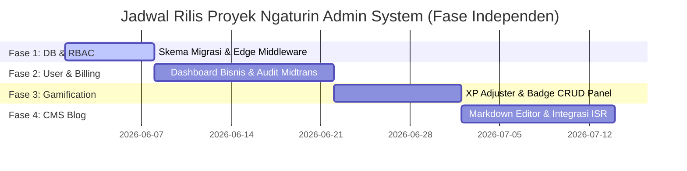

# Product Requirement Document (PRD)
## Ngaturin Admin System & Headless Blog CMS

* **Document Owner**: Zulvan Avito (Product Owner) & AI Development Lead
* **Date**: 2026-05-18
* **Status**: **APPROVED / READY FOR IMPLEMENTATION**
* **Target Release**: Version 1.0.0 (Internal Admin Portal)
* **Tech Stack Reference**: Separate React/Next.js Project, Shared Supabase Database, Cloudflare R2 (S3-Compatible Object Storage), Midtrans Snap/Core API, Resend Email Service.

---

## 1. Executive Summary & Product Vision

### 1.1 Goal
Membangun **Ngaturin Admin System** sebagai aplikasi web terpisah untuk memantau performa bisnis, mengelola profil keanggotaan pengguna, melakukan audit rekonsiliasi transaksi pembayaran Midtrans, mengelola mesin gamifikasi (XP & Badges), serta menyediakan sistem manajemen konten blog (*Headless Blog CMS*) terintegrasi yang menyajikan panduan finansial dan metode produktivitas PARA secara instan kepada pengguna.

### 1.2 Value Proposition
* **Decoupled Architecture**: Menjaga aplikasi pengguna utama (*User App*) tetap ringan dan berkinerja tinggi dengan memisahkan fungsi admin yang sarat data agregasi ke repositori terpisah.
* **Single Source of Truth**: Memanfaatkan basis data PostgreSQL Supabase yang sama untuk menghindari kompleksitas API sinkronisasi data antar-layanan.
* **Operational Control**: Memberikan kendali penuh pada tim operasional Ngaturin untuk merespons kegagalan pembayaran, memberikan XP penghargaan komunitas, membuat pencapaian baru secara visual, dan mempublikasikan panduan edukatif berkecepatan tinggi dengan integrasi SEO unggul.

---

## 2. System Architecture & Database Design

Sistem ini didesain menggunakan **Shared Database Model** dengan skema otorisasi berbasis peran (Role-Based Access Control) untuk melindungi kerahasiaan data pengguna utama.

```
+------------------------------------------+
|            Database Supabase             |
|   (PostgreSQL + RLS + Admin Service Role)|
+--------------------+---------------------+
                     |
         +-----------+-----------+
         |                       |
         v                       v
+------------------+   +-------------------+
|  User App (Next) |   |  Admin App (Vite) |
|  - Strictly RLS  |   |  - Bypass RLS     |
|  - User Auth     |   |  - Role = 'admin' |
+------------------+   +-------------------+
```

### 2.1 Database Migrations Required (Skema Baru)
Dua tabel baru wajib dideklarasikan pada database Supabase untuk mendukung peran admin dan blog:

#### A. Tambahan pada Tabel `user_profiles`
* Menambahkan kolom `role` (TEXT, default `'user'`) untuk membedakan hak akses. Nilai valid: `'user'`, `'moderator'`, `'admin'`.

#### B. Tabel `blog_posts`
```sql
CREATE TABLE public.blog_posts (
  id              UUID DEFAULT gen_random_uuid() PRIMARY KEY,
  title           TEXT NOT NULL,
  slug            TEXT NOT NULL UNIQUE,
  content         TEXT NOT NULL,
  excerpt         TEXT NOT NULL,
  cover_image_url TEXT,
  category        TEXT NOT NULL,
  tags            TEXT[] DEFAULT '{}',
  status          TEXT NOT NULL DEFAULT 'draft', -- draft, published, archived
  is_featured     BOOLEAN DEFAULT FALSE,
  author_id       UUID NOT NULL REFERENCES auth.users(id),
  published_at    TIMESTAMPTZ,
  created_at      TIMESTAMPTZ DEFAULT NOW(),
  updated_at      TIMESTAMPTZ DEFAULT NOW()
);
```

#### C. Tabel `admin_audit_logs`
```sql
CREATE TABLE public.admin_audit_logs (
  id              UUID DEFAULT gen_random_uuid() PRIMARY KEY,
  admin_id        UUID NOT NULL REFERENCES auth.users(id),
  action          TEXT NOT NULL, -- e.g., 'SUSPEND_USER', 'REFUND_TRANSACTION', 'CREATE_BADGE'
  details         JSONB NOT NULL,
  created_at      TIMESTAMPTZ DEFAULT NOW()
);
```

---

## 3. Functional Requirements (Spesifikasi Fitur)

### 3.1 Module 1: Business Intelligence Dashboard
* **FR-1.1 (Business Metrics)**: Sistem harus menampilkan agregasi total pengguna terdaftar, pengguna aktif bulanan (MAU), tingkat konversi langganan berbayar (Plus/Pro), Monthly Recurring Revenue (MRR), dan Annual Recurring Revenue (ARR).
* **FR-1.2 (Interactive Charts)**: Menampilkan diagram tren pendaftaran pengguna baru harian, mingguan, dan bulanan menggunakan pustaka charting interaktif.
* **FR-1.3 (Fintech Insights)**: Menampilkan rata-rata nilai *Emergency Runway* dan persentase alokasi pengeluaran global pengguna berdasarkan kerangka 50/30/20 untuk keperluan riset produk secara anonim.

### 3.2 Module 2: User & Gamification Administration
* **FR-2.1 (User Directory)**: Menyediakan tabel data pengguna terdaftar lengkap dengan fitur pencarian nama/email, pemfilteran berdasarkan level, status akun (Aktif/Ditangguhkan), dan tipe paket langganan.
* **FR-2.2 (Account Action)**: Admin diizinkan menangguhkan (*suspend*) akun pengguna yang melanggar ketentuan layanan secara instan dengan satu klik.
* **FR-2.3 (XP Console Adjustment)**: Menyediakan antarmuka untuk menyesuaikan XP dan Level pengguna secara manual disertai dengan pengisian alasan penyesuaian untuk riwayat audit.
* **FR-2.4 (Badge CRUD Panel)**:
  * CRUD visual untuk daftar Lencana (*badges*).
  * Input parameter: nama lencana, deskripsi lencana, tipe syarat pencapaian (`TRANSACTION_COUNT`, `STREAK_DAYS`, `GOAL_COMPLETED`, `DEBT_SETTLED`), nilai target pemenuhan syarat, dan penentuan besaran hadiah XP (*XP reward*).
* **FR-2.5 (User Information Editing - Koreksi Data)**: Admin berwenang mengedit informasi dasar profil pengguna (nama lengkap, avatar, atau peranan/role) apabila terdapat kesalahan input data atas permintaan resmi pengguna.
* **FR-2.6 (Soft Delete / Inactive Account Suspension)**: Untuk akun yang tidak aktif dalam jangka panjang (>12 bulan) atau melakukan pelanggaran ringan, admin dapat mengubah status profil menjadi `inactive` atau `suspended`. Seluruh data riwayat transaksi finansial tetap dipertahankan agar visualisasi laporan arus kas dan metrik bisnis global (MRR/ARR) tetap akurat secara historis.
* **FR-2.7 (Hard Delete / Right to be Forgotten - Kepatuhan UU PDP)**:
  * Memenuhi hak pengguna untuk dihapus (*Right to be Forgotten* sesuai regulasi UU Pelindungan Data Pribadi / UU PDP Indonesia).
  * Admin dapat memicu penghapusan permanen akun pengguna menggunakan Supabase Admin Auth API (`auth.admin.deleteUser`).
  * Sistem wajib mengimplementasikan **Cascading Deletion** (`ON DELETE CASCADE`) pada database PostgreSQL Supabase. Penghapusan akun secara otomatis akan menghapus seluruh data terkait (profil, saldo dompet, transaksi, target keuangan, dan portofolio investasi) dari penyimpanan secara permanen untuk menjamin pembersihan data privasi total.
* **FR-2.8 (Data Mutation Audit Logs)**: Setiap tindakan perubahan data profil (FR-2.5), penangguhan (FR-2.6), maupun penghapusan permanen (FR-2.7) yang dilakukan oleh admin wajib mencatat identitas admin eksekutor, ID pengguna target, jenis aksi, nilai sebelum dan sesudah perubahan, serta timestamp ke tabel `admin_audit_logs`.

### 3.3 Module 3: Billing & Subscription Audit
* **FR-3.1 (Transaction Ledger)**: Menampilkan riwayat pembayaran pengguna yang mencakup data ID pesanan Midtrans, jumlah pembayaran, tipe pembayaran, waktu pembuatan, dan status pembayaran riil.
* **FR-3.2 (Reconciliation Tool)**: Menyediakan fungsi sinkronisasi sekali klik untuk mencocokkan status invoice Supabase dengan data status pembayaran aktual di gateway Midtrans untuk menangani delay webhook.
* **FR-3.3 (Manual Subscription Extension)**: Admin diizinkan memperpanjang masa aktif paket premium (Plus/Pro) pengguna secara manual untuk kompensasi kendala transaksi.
* **FR-3.4 (Refund Trigger)**: Terintegrasi dengan API Midtrans untuk melakukan pembatalan (*cancel*) atau pengembalian dana (*refund*) transaksi langganan pengguna dari panel admin.

### 3.4 Module 4: Headless Blog CMS (Sistem Konten Blog)
* **FR-4.1 (Text Editor)**: Menyediakan Rich Text/Markdown Editor modern dengan kemampuan drag-and-drop media (gambar). Gambar akan diunggah otomatis ke Cloudflare R2 menggunakan mekanisme Presigned S3 URL untuk meniadakan biaya *egress* dan mempercepat *loading* via CDN.
* **FR-4.2 (SEO Optimization Console)**: Input khusus untuk kustomisasi slug URL ramah SEO, pengisian tag Meta-Title, dan Meta-Description.
* **FR-4.3 (Status & Featured Toggle)**: Pilihan untuk menyimpan artikel sebagai draft, diterbitkan langsung, atau diarsipkan, serta opsi menandai sebagai "Featured" untuk ditempatkan pada halaman utama blog pengguna.
* **FR-4.4 (User App Integration)**: User App wajib mengonsumsi data dari tabel `blog_posts` ini menggunakan Next.js Incremental Static Regeneration (ISR) agar SEO ramah dan halaman dimuat dalam hitungan milidetik.

### 3.5 Module 5: Operations & Audit Trails
* **FR-5.1 (Action Logging)**: Setiap aksi sensitif yang dilakukan oleh admin (seperti penyesuaian XP, suspend pengguna, perpanjangan manual langganan, dan pembuatan badge) wajib dicatat secara otomatis ke dalam tabel `admin_audit_logs`.
* **FR-5.2 (Broadcast Engine)**: Admin diizinkan mengirim pengumuman darurat atau panduan keuangan ke seluruh email pengguna menggunakan layanan **Resend** dengan opsi penyaringan segmentasi target penerima.

---

## 4. Product Boundaries (Batasan Sistem)

Untuk menghindari kerusakan data dan tumpang tindih logika bisnis, batasan tegas berikut diberlakukan secara mutlak:

* **Inkonsistensi Transaksi Keuangan**: Admin App **TIDAK boleh** memiliki modul untuk menambah, mengedit, atau menghapus data baris transaksi harian pengguna secara langsung. Semua data transaksi riil murni ditulis oleh tindakan pengguna di User App.
* **Inisiasi Pembayaran**: Transaksi pembayaran Snap baru hanya bisa dimulai secara lokal oleh pengguna di User App. Admin App hanya berhak mengelola, memverifikasi, atau memicu refund dari transaksi yang sudah ada.
* **Perlindungan Klien-Sisi**: Supabase Service Role Key **DILARANG** dimasukkan ke dalam kode Admin App sisi klien (*client-side code*). Segala komunikasi database yang memanfaatkan Service Role Key harus dibungkus melalui API Route internal server-to-server di backend Admin App.

---

## 5. Non-Functional Requirements (Persyaratan Non-Fungsional)

### 5.1 Security & Access Control
* **Authorization Matrix**:

| Role | Access Level | Permissions |
| :--- | :--- | :--- |
| **Standard User** | User App Only | Hanya data milik sendiri (diatur oleh RLS). Akses ke Admin App ditolak mutlak di tingkat Edge Middleware. |
| **Moderator** | Admin App | Dapat mengelola user directory, menyunting katalog aset, mengelola konten blog draft/publish, dan meninjau audit logs. Tidak bisa memicu refund atau suspend pengguna. |
| **Admin** | Admin App | Akses penuh tanpa batas (Bypass RLS, Manual Override Langganan, Refund Midtrans, Suspend Akun, Badge CRUD, dan Audit Logs). |

* **Auditability**: Seluruh aktivitas administratif wajib memiliki catatan log audit permanen yang tidak dapat dimanipulasi (*immutable*) di database.

### 5.2 Performance & Reliability
* **Data Refresh Rate**: Dashboard metrik bisnis admin menggunakan revalidation data minimal 5 menit sekali (caching) untuk menghindari lonjakan beban query database Supabase.
* **Blog Loading Time**: Halaman blog pengguna wajib dimuat dalam waktu kurang dari **1.5 detik** menggunakan static caching (ISR), dengan pemicu regenerasi otomatis (*on-demand revalidation*) sesaat setelah admin menekan tombol publikasi di Admin App.
* **Vercel React Best Practices Compliance**: Seluruh pengembangan wajib mematuhi standar ketat dari modul keterampilan `.agents/skills/vercel-react-best-practices/SKILL.md`. Ini termasuk mengeliminasi *waterfall network requests* dan memaksimalkan penggunaan React Server Components (RSC) untuk merender tabel data kompleks.

### 5.3 UI/UX Design Guidelines (Wise Admin Console Style)
* **Visual Theme**: Mengadopsi modifikasi Wise Theme dengan warna aksen utama **Wise Cyan** (`#70e6e8` / `rgb(112, 230, 232)`) dipadukan dengan Near Black (`#0e0f0c`).
* **High Information Density**: Tata letak grid padat dengan radius kartu `16px` (lebih kecil dibanding User App) untuk efisiensi ruang saat menganalisis tabel data besar dan grafik keuangan.

---

## 6. Milestones & Release Plan



* **Milestone 1 (Fase 1 - Database & Otorisasi)**: Penyusunan skema migrasi tabel baru, pembuatan user roles di database, dan pengaktifan filter Edge Middleware di Admin App.
* **Milestone 2 (Fase 2 - Manajemen Pengguna & Keuangan)**: Integrasi tabel user directory, sinkronisasi dashboard MRR, audit log pembayaran, rekonsiliasi Midtrans, dan manual override langganan premium.
* **Milestone 3 (Fase 3 - Gamifikasi & Katalog Aset)**: Rilis panel Badge CRUD, XP adjuster console, serta database editor simbol portofolio investasi Yahoo Finance.
* **Milestone 4 (Fase 4 - Headless Blog CMS)**: Rilis Markdown Editor, integrasi unggahan gambar Cloudflare R2 (Presigned S3 URL), dan perakitan halaman blog berkecepatan tinggi (ISR Next.js) di User App.
